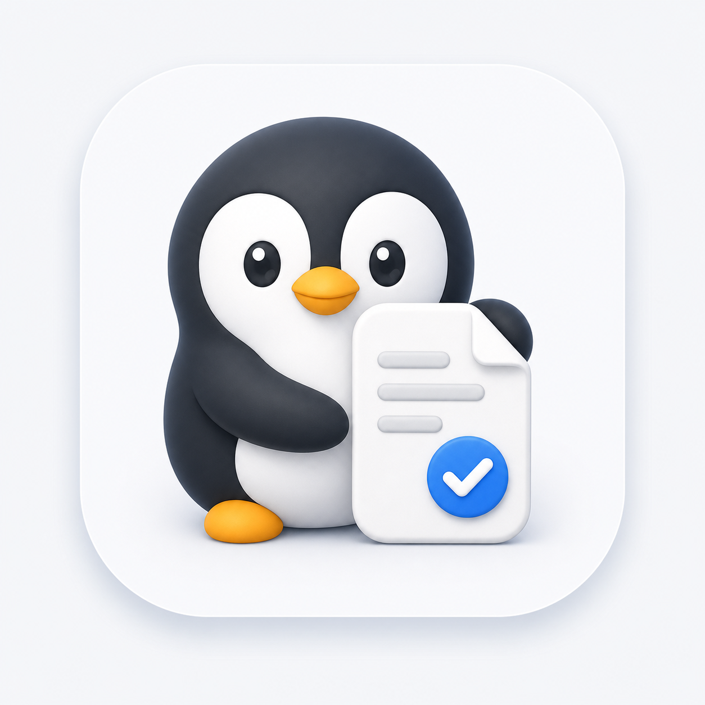

# Obsidian Note Saver

<p align="center">
  
</p>

<p align="center">
  <strong>A small Windows helper app that turns quick thoughts into organized Obsidian notes.</strong>
</p>

<p align="center">
  
  
  
  
  
</p>

Obsidian Note Saver is a lightweight Windows desktop app for people who capture notes quickly but do not want to manually decide where every note belongs. Paste a rough memo, choose a save mode, and the app uses Gemini CLI or Codex CLI to classify the note, add front matter, and save it into the right place in your Obsidian vault.

The project was built for a PARA-style Obsidian vault, but the rules are intentionally simple enough to adapt.

## Who This Is For

- Obsidian users who capture many rough notes throughout the day.
- People who use a PARA-like vault structure such as `00 Inbox`, `10 Projects`, `20 Areas`, and `30 Resources`.
- Operators, PMs, researchers, and makers who want meeting notes, ideas, and working docs filed without breaking focus.
- Users who already use CLI AI tools such as Gemini CLI or Codex CLI and want those tools wrapped in a small desktop workflow.
- Anyone who wants an "inbox first, organize later" workflow, but with AI-assisted filing when the note is ready.

## What It Does

- Saves a memo directly into an Obsidian vault as Markdown.
- Classifies notes into folders based on content and title.
- Adds YAML front matter for note type, tags, summary, source, and timestamps.
- Supports two save styles:
  - `내용 다듬기`: refine and structure the content before saving.
  - `원문 유지`: preserve the original body and only apply folder/properties.
- Supports a fast `Inbox에 바로 저장` path that skips AI.
- Shows progress while the AI process is running, so the save action does not feel like the app froze.
- Opens the saved note in Obsidian with an `obsidian://` URI.
- Copies the saved file path when needed.
- Provides Windows shortcuts and a taskbar-friendly launcher.

## Workflow

```text
Paste memo
  -> choose type and save mode
  -> choose Gemini or Codex
  -> AI returns a JSON save plan
  -> app validates the path stays inside the vault
  -> Markdown file is written
  -> open in Obsidian or copy the saved path
```

For quick capture, use `Inbox에 바로 저장`:

```text
Paste memo
  -> Inbox save
  -> 00 Inbox/YYYY-MM-DD_title.md
```

## Vault Layout

The app assumes it lives inside the vault at:

```text
<Obsidian Vault>/
  00 Inbox/
  10 Projects/
  20 Areas/
  30 Resources/
    Tools/
      ObsidianNoteSaver/
```

The vault root is inferred from the app folder by walking up three levels. In this setup, `ObsidianNoteSaver.ps1` resolves the vault as `..\..\..`.

Default folder behavior:

- `00 Inbox`: unclear or quick-capture notes.
- `10 Projects`: project-specific notes with a clear outcome.
- `20 Areas`: ongoing responsibility areas.
- `30 Resources`: reusable references, prompts, tools, and knowledge.

## Requirements

- Windows 10 or 11.
- Windows PowerShell 5.1 or later.
- Obsidian installed and associated with your vault.
- At least one supported CLI AI tool:
  - Gemini CLI: recommended default when available.
  - Codex CLI: supported alternative.

Gemini CLI is preferred if you want the app to avoid Codex token usage.

## Install

Place this project at:

```text
<Obsidian Vault>\30 Resources\Tools\ObsidianNoteSaver
```

Then run:

```powershell
.\InstallShortcuts.cmd
```

This creates:

- Desktop shortcut: `Obsidian Note Saver`
- Start Menu shortcut: `Obsidian Note Saver`
- Hotkey on the desktop shortcut: `Ctrl + Alt + O`

The shortcut target is `ObsidianNoteSaver.exe`, a tiny launcher that starts the PowerShell WPF app. This makes Windows taskbar pinning more reliable than pinning `powershell.exe` with script arguments.

To launch manually:

```powershell
.\ObsidianNoteSaver.cmd
```

To rebuild the launcher executable:

```powershell
.\BuildLauncher.cmd
```

## Pin To Taskbar

Windows often blocks apps from pinning themselves to the taskbar automatically. This project uses a safe helper instead:

```powershell
.\PinToTaskbar.cmd
```

That opens the Start Menu shortcut location. Right-click `Obsidian Note Saver`, then choose `작업 표시줄에 고정`.

If an older taskbar item points to the removed widget launcher, run:

```powershell
.\InstallShortcuts.cmd
```

The installer repairs existing `Obsidian Note Saver` taskbar shortcuts and the legacy `Obsidian Note Saver Widget` pinned shortcut so they launch `ObsidianNoteSaver.exe`.

## Usage

1. Open `Obsidian Note Saver`.
2. Add a title hint.
3. Paste the note body.
4. Choose a note type.
5. Choose an AI provider: `Gemini` or `Codex`.
6. Choose a save mode:
   - `내용 다듬기`: AI rewrites and structures the note.
   - `원문 유지`: AI only classifies; the original body is preserved.
7. Click `저장하기`.
8. Open the note in Obsidian or copy the saved path.

For immediate capture without AI, click `Inbox에 바로 저장`.

## Save Modes

### 내용 다듬기

Use this when your memo is messy and you want it turned into a cleaner note.

Good for:

- meeting notes
- planning notes
- idea dumps
- research snippets
- rough outlines

### 원문 유지

Use this when the content itself should not be rewritten.

Good for:

- quoted notes
- raw meeting transcripts
- exact decisions
- pasted external text
- notes where wording matters

## AI Providers

### Gemini CLI

If Gemini CLI is installed, the app selects it by default.

The app asks Gemini to return JSON that matches the local schema, then writes the file itself. This keeps file writes inside the app and makes path validation simpler.

### Codex CLI

Codex CLI is also supported. It can be selected manually in the app.

Codex is useful if your local Codex setup has better context or if you want to reuse an existing Codex workflow.

## Safety

- The app validates that AI-proposed paths stay inside the vault.
- Existing files are not overwritten; duplicate names get a suffix.
- If AI output is not valid JSON, the raw response is saved under `.tmp` for debugging.
- The last error is written to `.tmp/last-error.txt`.
- The fast Inbox path does not call AI.

## Project Structure

```text
ObsidianNoteSaver/
  Assets/
    obsidian-note-saver-penguin.png
    obsidian-note-saver-penguin.ico
  ObsidianNoteSaver.ps1
  ObsidianNoteSaver.cmd
  ObsidianNoteSaverLauncher.cs
  BuildLauncher.ps1
  BuildLauncher.cmd
  InstallShortcuts.ps1
  InstallShortcuts.cmd
  PinToTaskbar.cmd
  classification.schema.json
  refine.schema.json
  README.md
  PROJECT.md
```

## Checks

Run the setup check:

```powershell
powershell.exe -NoProfile -ExecutionPolicy Bypass -File ".\ObsidianNoteSaver.ps1" -SelfTest
```

Run the UI load check:

```powershell
powershell.exe -NoProfile -ExecutionPolicy Bypass -STA -File ".\ObsidianNoteSaver.ps1" -UiSelfTest
```

Expected checks include:

- vault path
- prompt path
- inbox folder
- assets
- JSON schemas
- Codex CLI availability
- Gemini CLI availability

## Troubleshooting

### The app opens, but saving fails

Check:

```text
.tmp/last-error.txt
```

If the AI response was malformed, also check files under `.tmp`.

### Gemini or Codex is not detected

Open a new terminal and run:

```powershell
gemini --version
codex --version
```

If the command is missing, install the CLI or make sure it is available in `PATH`.

### The note opens in File Explorer but not Obsidian

Make sure Obsidian is installed and the target vault has been opened at least once. The app uses an `obsidian://open` URI.

### The taskbar icon does not update

Run:

```powershell
.\InstallShortcuts.cmd
```

Then unpin and pin the Start Menu shortcut again.

## Customization

The classification behavior is mostly controlled by:

- the prompt file in your vault: `30 Resources\Prompt\2026-05-07_Obsidian_문서_저장_프롬프트.md`
- `classification.schema.json`
- `refine.schema.json`
- the folder rules in `ObsidianNoteSaver.ps1`

For another vault layout, update the folder rules and prompt together.

## Roadmap Ideas

- Config file for vault path and folder rules.
- Tray icon mode.
- Save templates per note type.
- Optional daily note integration.
- More portable installer.
- Multi-vault support.

## Notes

This is a personal productivity tool, not a general Obsidian plugin. It is intentionally implemented as a Windows helper app so it can call local CLI tools and write directly into the vault.
